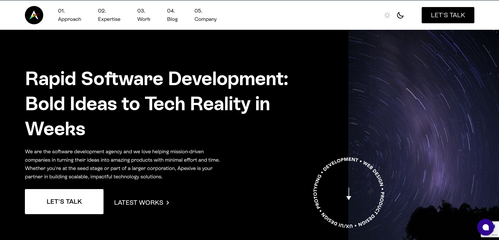

# Apexive Theme for Odoo

The Apexive Theme is a sleek and modern eCommerce theme, converted from Webflow, designed specifically for Odoo platforms. This theme brings a sophisticated visual appeal and an optimized eCommerce experience to your online store.

## Features

- **Responsive Design**: Ensures your site looks great on all devices from desktops to smartphones.
- **Customizable Layout**: Easy drag-and-drop building blocks allow for beautiful and flexible page creation.
- **Enhanced User Experience**: Includes a variety of custom-designed snippets such as hot sales, new arrivals, and time-sensitive deals.

## Screenshots

## Description

Apexive Theme is not just about aesthetics; it's built to improve functionality and user experience. It includes everything you need to run a successful online store:

- **Hot Sales, New Arrivals, and Deals**: Snippets that are easily configured from the backend to highlight special offers.
- **Instagram Feed and Deal of the Week Snippets**: Add social proof and urgency with these integrated features.
- **Fully Customizable Pages**: From the homepage to the shop view, every part of your eCommerce site can be customized to meet your needs.

## Customization

This theme is designed to be user-friendly and easily adjustable:

- **Desktop and Mobile Views**: Adjust layouts and elements to ensure the best display on all devices.
- **Shop and Product Pages**: Styled to enhance product displays and improve customer conversion rates.

## Additional Information

- **Installation**: Follow standard Odoo module installation procedures.
- **Dependencies**: Ensure you have the latest version of Odoo installed along with any specific dependencies noted in the module manifest.

## Support

For support, assistance, or to report issues, please contact:

- Email: [support@apexive.com](mailto:support@apexive.com)
- More details are available on our website.

Thank you for choosing the Apexive theme for your Odoo store!

